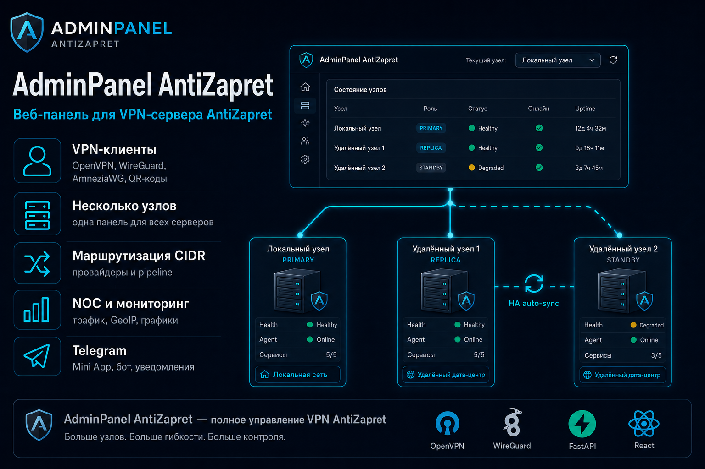
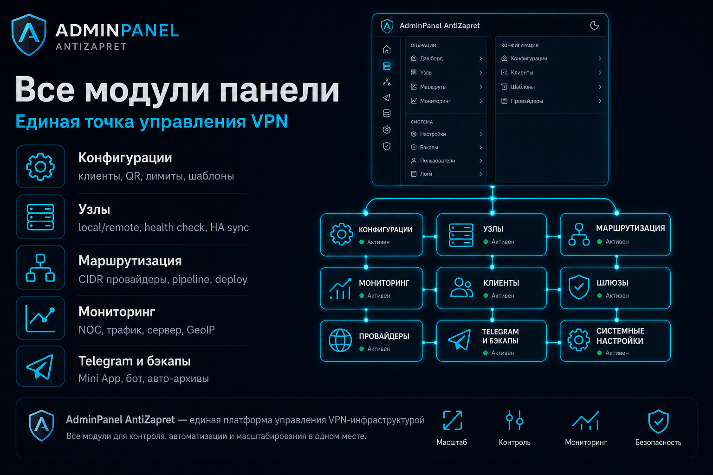
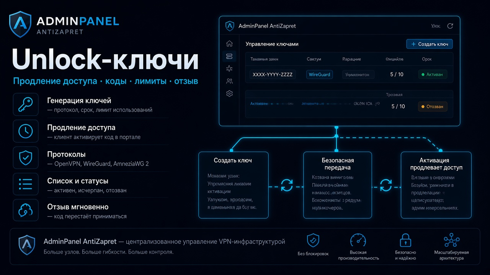
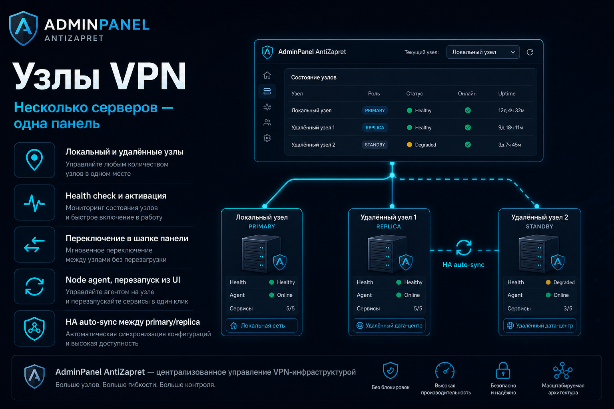
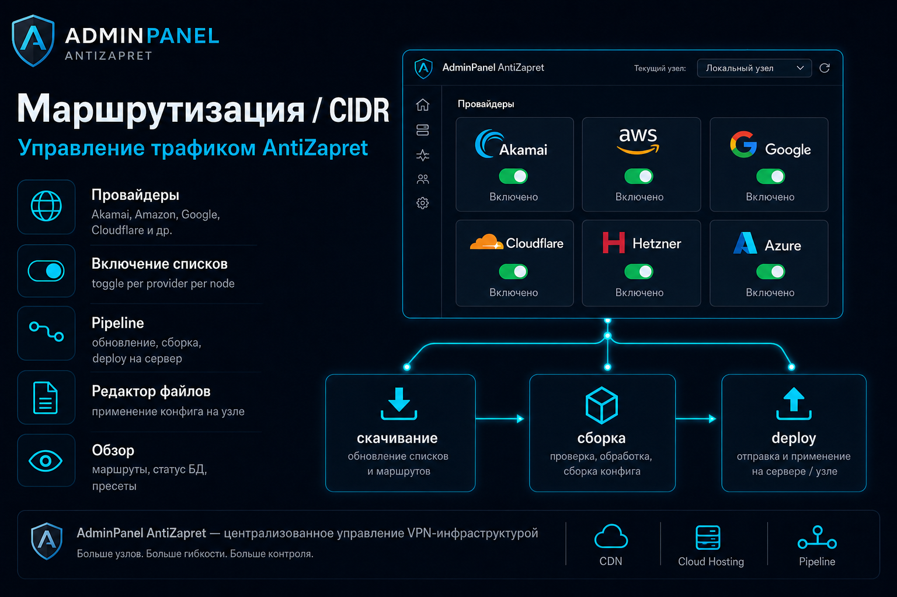
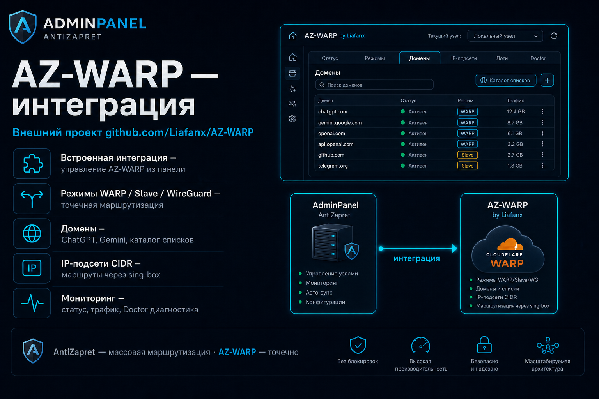
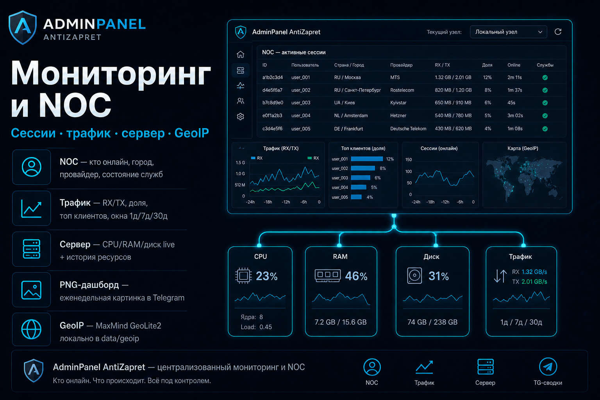
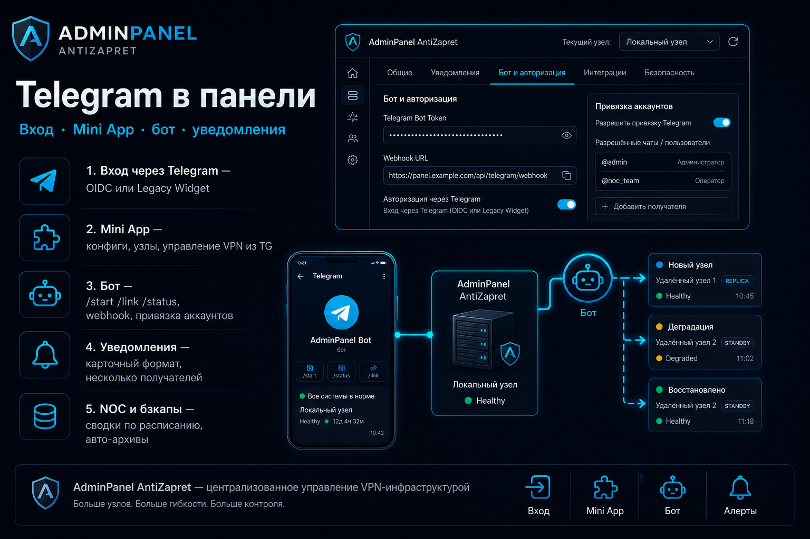
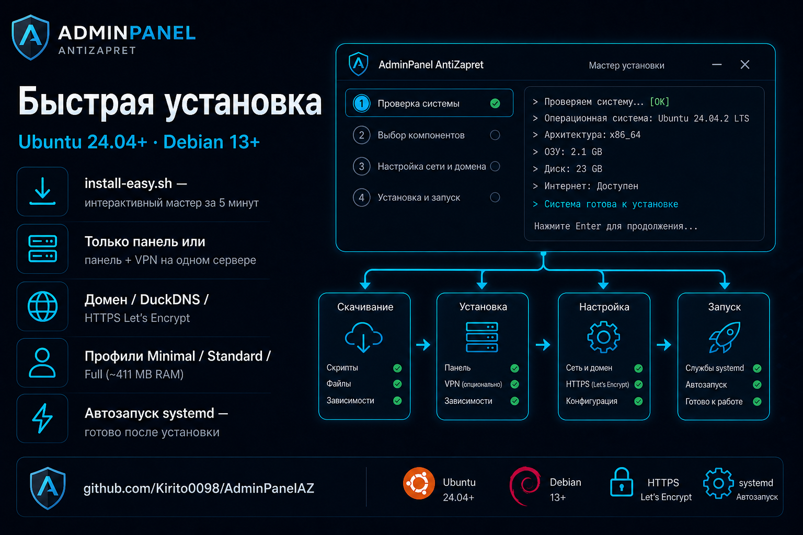

# 🛡️ AdminPanel AntiZapret

Веб-панель для администрирования VPN-сервера [AntiZapret](https://github.com/shax0491/AntiZapret-VPN_new): клиенты, маршрутизация, мониторинг, бэкапы, Telegram.

[](https://github.com/shax0491/AdminPanelAZ_new)
[](CHANGELOG.md)
[](CHANGELOG.md)
[](backend/)
[](frontend/)

[🚀 Установка](#-быстрый-старт) · [✨ Возможности](#-возможности) · [📖 Все инструкции](docs/README.md)

<p align="center">
  
</p>

> AntiZapret ставится **отдельно**, на сам VPN-сервер — см. [инструкцию AntiZapret-VPN](https://github.com/shax0491/AntiZapret-VPN_new). Эта панель только управляет им (или несколькими такими серверами) через веб-интерфейс.

---

## 🚀 Быстрый старт

**Требования:** Ubuntu 24.04+ или Debian 13+, root / sudo, доступ в интернет.
После полного `apt upgrade` (новое ядро) сначала **перезагрузите сервер**, затем запускайте `install.sh` — установщик сам предупредит, если reboot ещё не сделан.
AntiZapret ставится **отдельно** на VPN-сервер — см. [AntiZapret-VPN](https://github.com/GubernievS/AntiZapret-VPN).

**Python:** установщик сам выбирает runtime через `scripts/python-runtime.sh` — на **Ubuntu 24.04** это **3.12**, на **Debian 13** — **3.13**.

**Node.js:** для сборки интерфейса нужен **22+**. Если в системе Node старее или его нет, установщик ставит его из apt (если там 22+), иначе **24.x** из NodeSource. На уже установленной панели Node обновляется отдельно — повторным `install.sh` или через NodeSource.

### Порты

После `install.sh` панель сразу доступна по **HTTP** (`http://IP:порт/`, обычно **8000**). HTTPS и Nginx настраиваются позже в UI.

| Порт | Назначение | Куда открывать |
| --- | --- | --- |
| **8000** (или выбранный) | Панель | LAN / интернет — пока панель на этом порту |
| **9100** | Node agent | localhost или между панелью и VPN-узлом (при **SSH-транспорте** агент может слушать только `127.0.0.1`) |
| **22** (типично) | SSH к VPN-узлу | только если включён модуль **SSH transport узлов** |
| **80** / **443** | HTTP ACME / HTTPS | после публикации в **Настройки → Адрес сайта и HTTPS** |

Порты **OpenVPN / WireGuard / AmneziaWG** задаёт **AntiZapret**, не панель.
Откройте порт панели у хостера или вручную (`ufw` / security group). Подробнее: [SECURITY.md](SECURITY.md).

### Варианты установки

Первый вопрос мастера — **что ставим на этот сервер**:

| Вариант | Что ставится | Когда выбирать |
| --- | --- | --- |
| **Только панель** | Веб-интерфейс управления | Отдельный **управляющий сервер**; к нему потом подключаются VPN-узлы (AntiZapret на других машинах) |
| **Панель + узел** | Панель и **локальный узел** на одном хосте | **AntiZapret уже установлен** на этом же сервере (`/root/antizapret`) — типичный случай «всё на одном VDS» |
| **Узел** | Только **node agent** (без панели) | Отдельный **VPN-сервер**, который нужно **подключить к уже работающей панели** на другом хосте |
| **Прокси** | Только **proxy_agent** (без панели и без `proxy.sh`) | Отдельный **RU VPS**, где вы **уже** поставили AntiZapret `proxy.sh`; агент — мониторинг и смена DESTINATION из панели ([прокси](docs/proxy-nodes.md), [установка агента](docs/proxy-agent.md)) |

#### Установка

Один скрипт — `install.sh`:

```bash
sudo apt update && sudo apt install -y git wget curl
curl -fsSL https://raw.githubusercontent.com/shax0491/AdminPanelAZ_new/refs/heads/main/install.sh | sudo bash
```

Установщик задаст несколько вопросов: что ставим, порты, логин/пароль администратора, каталог бэкапов. После установки панель сразу открывается по `http://IP:порт/` (обычно **8000**).

### Что именно ставить

Первый вопрос мастера — какую роль играет этот сервер:

| Вариант | Что ставится | Когда выбирать |
| --- | --- | --- |
| **Только панель** | Веб-интерфейс | Отдельный управляющий сервер; VPN-узлы подключаются к нему извне |
| **Панель + узел** | Панель и агент на одном хосте | AntiZapret уже стоит на этом же сервере — «всё на одном VDS» |
| **Узел** | Только node agent | VPN-сервер, который нужно подключить к панели на другом хосте |
| **Прокси** | Только proxy_agent | RU VPS с уже установленным `proxy.sh` — агент даёт мониторинг и смену адреса из панели ([инструкция](docs/proxy-agent.md)) |

### Порты

| Порт | Для чего | Кому открывать |
| --- | --- | --- |
| **8000** (или свой) | Панель | LAN/интернет |
| **9100** | Node agent | Между панелью и узлом (localhost при SSH-транспорте) |
| **80 / 443** | HTTPS | После настройки домена в панели |

Порты OpenVPN/WireGuard/AmneziaWG задаёт сам **AntiZapret**, не панель. Подробнее об открытии портов — [SECURITY.md](SECURITY.md).

### ✅ После установки — что сделать первым делом

- [🚀 Быстрый старт](#-быстрый-старт)
  - [Варианты установки](#варианты-установки)
- [🖼️ Обзор панели](#-обзор-панели)
- [✨ Возможности](#-возможности)
- [✅ После установки](#-после-установки)
  - [Вход после установки](#вход-после-установки)
  - [Обновление](#-обновление)
- [📖 Руководства пользователя](#-руководства-пользователя)
- [🌐 Бесплатный адрес (DDNS)](#-бесплатный-адрес-для-панели-ddns)
- [🔗 StatusOpenVPN на одном домене](#-statusopenvpn-на-одном-домене)
- [⚙️ Production: VDS, Redis и профили](#️-production-vds-redis-и-профили)
- [🔐 Безопасность](#-безопасность)
- [💻 Полезные команды](#-полезные-команды-на-сервере)
- [📝 История изменений](#-история-изменений)
- [💖 Поддержка проекта](#-поддержка-проекта)

Авто-бэкап включается после установки сам (раз в 7 дней) — [настройка](docs/nastrojki/rezervnye-kopii.md).

---

## ✨ Возможности

<p align="center">
  
</p>

**VPN и клиенты** — OpenVPN, WireGuard, AmneziaWG: создание, QR-коды, блокировка, лимиты трафика ([инструкция](docs/konfiguracii.md)). Несколько серверов из одной панели ([узлы](docs/uzly.md)), отказоустойчивость HA ([Node Sync](docs/NodeSync.md)), автопереключение между узлами без переустановки клиента ([автопереключение](docs/autoswitch-howto.html)). Подписка с unlock-кодами и постоянные ссылки для клиентов — раздел **Подписка** ([инструкция](docs/podpiska.md)).

**Маршрутизация** — списки провайдеров (CIDR), пресеты, редактор конфигов AntiZapret с применением на сервер ([маршрутизация](docs/routing-cidr.md), [конфиг](docs/antizapret-config.md)), точечная маршрутизация через Cloudflare WARP ([AZ-WARP](docs/warper.md)).

**Мониторинг** — NOC: кто подключён, откуда, графики, состояние служб, сводки в Telegram ([инструкция](docs/noc-monitoring.md)); расход трафика по клиентам ([трафик](docs/traffic-monitoring.md)); живые CPU/RAM/диск и история за 30 дней ([сервер](docs/server-monitor.md)).

**Безопасность** — роли администратор/пользователь, 2FA, белый список IP, защита от перебора паролей ([безопасность](docs/nastrojki/bezopasnost.md)), бэкапы вручную и по расписанию с отправкой в Telegram.

- OpenVPN, WireGuard, AmneziaWG — создание, скачивание, QR-коды ([инструкция](docs/konfiguracii.md))
- Блокировка, срок действия, лимиты трафика
- **Подписка** — отдельный раздел меню (`/subscription`): unlock-коды и доступ до даты, настройка клиентского портала ([инструкция](docs/podpiska.md))
- **Срок доступа на пользователе** — поле «Доступ до» в **Настройки → Пользователи** продлевает или ограничивает сразу все его VPN-профили ([подписка](docs/podpiska.md#срок-доступа-пользователя))
- **Клиентский портал** — постоянные ссылки `https://portal…/p/c_…` для клиента и `…/p/u_…` для пользователя со всеми его профилями (статус, срок, трафик, установка профиля, unlock-ключ); автонастройка поддомена под текущий HTTPS

Полный список инструкций по каждому разделу: **[docs/README.md](docs/README.md)**.

<p align="center">
  
</p>

- Несколько VPN-серверов (узлов) из одной панели ([инструкция](docs/uzly.md))
- **Способ связи с агентом** — HTTP, HTTPS+mTLS или **SSH-туннель** (модуль, по умолчанию выкл.); preflight перед сменой ([SSH](docs/node-ssh-transport.md))
- **Прокси-узлы** (модуль, по умолчанию выкл.) — RU `proxy.sh` + `proxy_agent`, DESTINATION из панели, домашний IP в NOC ([прокси](docs/proxy-nodes.md))
- **HA (отказоустойчивость)** — группы синхронизации primary + replica, один домен, Push full (с префлайтом связи), verify и авто-репликация с primary ([Node Sync](docs/NodeSync.md), UI: **Узлы → Группы синхронизации**)

<p align="center">
  
</p>

### 🧭 Маршрутизация

<p align="center">
  
</p>

- Списки провайдеров (CIDR), пресеты, конфиг AntiZapret ([маршрутизация](docs/routing-cidr.md), [конфиг](docs/antizapret-config.md))
- Редактор файлов AntiZapret с применением на сервер ([инструкция](docs/edit-files.md))
- AZ-WARP — точечная маршрутизация через Cloudflare WARP ([инструкция](docs/warper.md))
- **OpenVPN Buffer Guard** — защита OpenVPN от шторма ENOBUFS: от уведомления до отключения клиента, перезапуска OpenVPN и временного бана (по умолчанию выкл.) ([инструкция](docs/antizapret-config.md#openvpn-buffer-guard-enobufs))
- **DNS: ответ на AAAA** — NODATA вместо `::` для AntiZapret и полного VPN, чтобы клиенты не подключались к `[::]` ([инструкция](docs/antizapret-config.md#dns-ответ-на-aaaa))

<p align="center">
  
</p>

### 📊 Мониторинг

<p align="center">
  
</p>

- **NOC** — кто подключён, откуда (город и провайдер), графики, состояние служб;
  **Telegram-сводки** — ежедневный/еженедельный текст и еженедельный PNG-дашборд
  ([инструкция](docs/noc-monitoring.md))
- **Трафик** — расход по клиентам и доля в общем объёме, лимиты, окна 1д / 7д / 30д ([инструкция](docs/traffic-monitoring.md))
- **Сервер** — live CPU/RAM/диск, **история ресурсов** за 1 / 7 / 30 дней, vnStat ([инструкция](docs/server-monitor.md))
- **Локальная GeoIP** — MaxMind GeoLite2 в `data/geoip/` ([инструкция](docs/GeoIP.md))

### 🔐 Безопасность и администрирование

- Роли: администратор, пользователь ([пользователи](docs/nastrojki/polzovateli.md))
- 2FA, белый список IP, защита от перебора паролей ([безопасность](docs/nastrojki/bezopasnost.md))
- Активные web-сессии: «Отозвать» сразу завершает сессию на сервере, смена пароля завершает все остальные сессии
- Вход через Telegram — Legacy Login Widget или OpenID Connect ([Telegram](docs/Telegram.md))
- Бэкапы вручную и по расписанию, отправка в Telegram; перед восстановлением панель сохраняет текущее состояние — три последние **копии перед восстановлением** можно откатить ([инструкция](docs/nastrojki/rezervnye-kopii.md))

### 💬 Telegram

<p align="center">
  
</p>

- **Вход в панель** — Legacy Login Widget или OpenID Connect (настройка на вкладке «Бот и авторизация»)
- **Mini App** — адаптированная панель и отправка VPN-конфигов из Telegram
- **Бот** — webhook, команды (`/start`, `/link`, `/status`, …), привязка и отвязка аккаунтов администратором; отвечает только в личных чатах, в группах и каналах команды игнорируются
- **Уведомления** — несколько получателей (admin из «Пользователи» + chat ID групп/каналов),
  карточный формат, тест каждого события
- **NOC и бэкапы** — сводки по расписанию в Telegram, авто-отправка архивов выбранным получателям

Пошаговая настройка и вкладки раздела: [docs/Telegram.md](docs/Telegram.md)

## ✅ После установки

<p align="center">
  
</p>

1. Откройте URL из вывода установщика (`http://IP:порт/`)
2. Войдите с логином и паролем из итоговой сводки установщика (блок «Учётные данные») — см. [вход после установки](#вход-после-установки)
3. **Смените пароль** и включите **2FA** — [Настройки → Мой профиль](docs/nastrojki/profil.md)
4. **Переключите панель на HTTPS** — **Настройки → Адрес сайта и HTTPS** (домен или DDNS + Let's Encrypt). HTTP удобен для первого входа, но для постоянной работы HTTPS надёжнее и безопаснее — [инструкция](docs/nastrojki/set-i-publikaciya.md)
5. Если VPN на другом сервере — добавьте узел (HTTP / mTLS / SSH) — [Узлы](docs/uzly.md) · [SSH-транспорт](docs/node-ssh-transport.md)
6. В разделе **Клиенты** нажмите **Синхронизировать** — [инструкция](docs/konfiguracii.md)
7. **Подписка** — unlock-коды и **клиентский портал** (поддомен + «Настроить под текущую публикацию»)
8. **Telegram** — раздел уже в меню; укажите bot token в UI — [инструкция](docs/Telegram.md)
9. Для **HA** (два сервера на один домен): создайте группу синхронизации на **Узлах**, нажмите **Синхронизировать** (домен → Push full → verify) — [Node Sync](docs/NodeSync.md). После обновления панели обновите **node agent** на VPN-узлах (**Узлы** → «Обновить», агент перезапустится сам), чтобы в «Узлах» отображалась версия **1.11.1**

> [!NOTE]
> **Авто-бэкап** после install включён (каждые **7** дней) — изменить в [Настройки → Резервные копии](docs/nastrojki/rezervnye-kopii.md).

### Вход после установки

Пароля `admin` / `admin` по умолчанию **нет**. Логин и пароль — в итоговой сводке `install.sh`, блок **«Учётные данные»**.

- Если на шаге **«Администратор»** нажали Enter (или запустили мастер с `-y` без `WIZ_ADMIN_PASSWORD`), генерируется случайный пароль из 16 символов (цифры и латинские буквы a–f). Он показывается сразу на этом шаге и ещё раз в конце установки — **запишите его**.
- Мастер не принимает пароль короче 8 символов, без букв или без цифр и совпадающий с логином. Слабый `WIZ_ADMIN_PASSWORD` при `-y` заменяется случайным с предупреждением.
- По умолчанию при первом входе панель требует сменить пароль (вопрос мастера «Требовать смену пароля при первом входе?»).
- До первой смены пароль хранится в `backend/.env` (права `600`) как `DEFAULT_ADMIN_PASSWORD`. После смены он остаётся только в БД, а `DEFAULT_ADMIN_PASSWORD` в `.env` очищается.
- В production панель не запустится со слабым `DEFAULT_ADMIN_PASSWORD` (`admin`, `password`, `123456`).
- Повторный запуск мастера задаёт пароль администратора заново (введённый или новый случайный). Если ставили без мастера (через `WIZ_*`) поверх существующей БД и пароль не задали, он не меняется — в сводке будет «Пароль администратора не менялся».

### 🔄 Обновление

- **Из панели:** **Настройки → Обновление панели** → «Применить обновление» (панель перезапустится сама) — [инструкция](docs/nastrojki/obnovleniya.md)
- **С сервера:** `sudo ./scripts/adminpanel-menu.sh --update` (код, Python-зависимости, сборка интерфейса), затем `sudo ./scripts/adminpanel-menu.sh --restart`

> [!IMPORTANT]
> **С 2.25.1 на 2.26.0** нужны дополнительные шаги: `--update` из меню дважды, Node.js 22+, node agent 1.11.0, смена ключей агентов, перегенерация nginx и др. — [Обновление с 2.25.1 до 2.26.0](docs/nastrojki/obnovleniya.md#обновление-с-2251-до-2260).

### 🗑️ Удаление и переустановка

```bash
sudo ./install.sh              # меню: переустановка или удаление
sudo ./install.sh --uninstall  # удалить сервисы панели
```

AntiZapret и VPN-конфиги при удалении панели **не трогаются**.

## 📖 Руководства пользователя

Полный список инструкций: **[docs/README.md](docs/README.md)**

- **VPN-клиенты** — [docs/konfiguracii.md](docs/konfiguracii.md)
- **Подписка и клиентский портал** — [docs/podpiska.md](docs/podpiska.md): срок доступа на пользователе, unlock-коды, постоянные ссылки `/p/c_…` и `/p/u_…`
- **Несколько серверов и HA** — [docs/uzly.md](docs/uzly.md) · [docs/NodeSync.md](docs/NodeSync.md) · [docs/node-ssh-transport.md](docs/node-ssh-transport.md)
- **Прокси AntiZapret** — [docs/proxy-nodes.md](docs/proxy-nodes.md) · [docs/proxy-agent.md](docs/proxy-agent.md)
- **NOC и трафик** — [docs/noc-monitoring.md](docs/noc-monitoring.md) · [docs/traffic-monitoring.md](docs/traffic-monitoring.md)
- **Настройки и бэкапы** — [docs/nastrojki/README.md](docs/nastrojki/README.md)
- **Адрес сайта, HTTPS, StatusOpenVPN** — [docs/nastrojki/set-i-publikaciya.md](docs/nastrojki/set-i-publikaciya.md)
- **Telegram** — [docs/Telegram.md](docs/Telegram.md)

## 🌐 Бесплатный адрес для панели (DDNS)

Если нет своего домена: **Настройки → Адрес сайта и HTTPS → Динамический DNS**.

- **[DuckDNS](https://www.duckdns.org/)** — создайте два имени (одно для AntiZapret, другое для панели), укажите панельное + token. VPN-имя DuckDNS как домен панели использовать нельзя — [подробнее](docs/nastrojki/set-i-publikaciya.md#duckdns-duckdnsorg).
- **[No-IP](https://www.noip.com)** или свой домен — на один hostname можно повесить несколько A-записей на разные IP.

Автообновление IP работает через systemd-таймер каждые 5 минут; вручную — `sudo ./scripts/ddns-update.sh update|status`.

## 🔗 Если на этом же домене уже стоит StatusOpenVPN

[StatusOpenVPN](https://github.com/TheMurmabis/StatusOpenVPN) занимает `https://домен/status/` — если поставить оба сайта на nginx независимо, будет конфликт.

Ставьте панель по HTTP, затем в **Настройки → Адрес сайта и HTTPS** включите Nginx + Let's Encrypt с подпутём `panel` и опцией **Интегрировать с StatusOpenVPN**. Получится `https://домен/status/` и `https://домен/panel/`. Не удаляйте StatusOpenVPN через его `uninstall` после интеграции — сломает nginx; если панель пропала — `sudo ./scripts/nginx-repair.sh`. Подробнее: [docs/nastrojki/set-i-publikaciya.md](docs/nastrojki/set-i-publikaciya.md#совместно-со-statusopenvpn-на-одном-домене).

## ⚙️ Продакшен: ресурсы и Redis

Ориентир по памяти (панель + локальный узел, профиль Full): ~400 МБ. Для одного VDS с VPN хватает 1-2 ГБ; только панель — 1 ГБ + swap.

При нескольких workers (`UVICORN_WORKERS > 1` в `backend/.env`) нужен Redis: `AUTH_RATE_LIMIT_BACKEND=redis`, `API_RATE_LIMIT_BACKEND=redis`, `REDIS_URL=redis://127.0.0.1:6379/0` — подробнее в [SECURITY.md](SECURITY.md). Модули и профиль меняются в **Настройки → Модули** ([инструкция](docs/nastrojki/moduli.md)).

Для приватных IP узлов (LAN) — `ALLOW_INTERNAL_NODES=true` в `.env`; mTLS/SSH настраиваются per-node в **Узлах** — [docs/uzly.md](docs/uzly.md) · [SSH-транспорт](docs/node-ssh-transport.md).

**Способ 1 — панель внутри сайта Status (UI, рекомендуется):** `sudo ./install.sh` (панель по HTTP) → **Настройки → Адрес сайта и HTTPS** → Nginx + Let's Encrypt → подпуть `panel` → **Интегрировать с StatusOpenVPN**. Итог: `https://домен/status/` и `https://домен/panel/`. Подпуть здесь обязателен.

**Способ 2 — Status внутри сайта панели (вручную):** панель на корне домена, Status ставится без своего nginx, а в nginx-сайт панели добавляется блок `location /status/` с `proxy_pass` на порт Status. Итог: `https://домен/status/` и `https://домен/`. Блок нужно добавлять заново после **Адрес сайта и HTTPS → Применить** и `nginx-repair.sh`.

> [!WARNING]
> Не удаляйте Status через его `uninstall` после интеграции — может сломать nginx и доступ к панели.
> Если панель пропала — по SSH: `cd /opt/AdminPanelAZ && sudo ./scripts/nginx-repair.sh`

```bash
sudo ./install.sh              # меню: переустановка или удаление
sudo ./install.sh --uninstall  # удалить только сервисы панели
```

## ⚙️ Production: VDS, Redis и профили

После установки: профиль **Full**, `UVICORN_WORKERS=1`. Профиль и модули меняются в **Настройки → Разделы панели** ([инструкция](docs/nastrojki/moduli.md)), затем `sudo systemctl restart adminpanelaz`.

**Ориентир по RAM** (Full, панель + локальная нода): ~**411 MB** стек (ср. ~148 MB за 7 дней). Для одного VDS с VPN — **1–2 GB**; только панель на Minimal — **1 GB** + swap.

**Workers > 1:** в `backend/.env` задайте `UVICORN_WORKERS=N` и Redis (`AUTH_RATE_LIMIT_BACKEND=redis`, `API_RATE_LIMIT_BACKEND=redis`, `REDIS_URL=redis://127.0.0.1:6379/0`), затем перезапустите панель. См. [SECURITY.md](SECURITY.md).

**LAN-ноды / mTLS / SSH:** приватные IP узлов — `ALLOW_INTERNAL_NODES=true` в `.env`; mTLS и SSH — per-node в UI **Узлы** (SSH — модуль **SSH transport узлов**). Подробнее: [docs/uzly.md](docs/uzly.md) · [docs/node-ssh-transport.md](docs/node-ssh-transport.md).

- **Health** — `GET /api/health`, `GET /api/health/deep`
- **Метрики** — `GET /metrics` (Prometheus)
- **Node agent** — **1.11.1** (для HA: ≥ 1.3.0; byte-copy `.ovpn` при Push full: ≥ 1.5.0; сроки сертификатов: ≥ 1.6.0; AZ-AWG2 / reboot: ≥ 1.7.0; uptime / `listen_tls` в `/health`: ≥ 1.8.0; AZ-WARP 1.5, файлы WARP/RPZ/Lua, OpenVPN Buffer Guard, `block-batch`: ≥ 1.11.0; без лишнего перезапуска OpenVPN после doall при multihome: ≥ 1.11.1)

## AmneziaWG 2.0

Клиенты AmneziaWG 2.0 создаются на странице «Клиенты» (протокол AmneziaWG 2.0), статус и мониторинг — на вкладке `/awg2`. Подробности: [docs/awg2.md](docs/awg2.md).

## AmneziaWG 3.1

Вкладка «AmneziaWG 3.1» (`/awg3`, фичефлаг `awg3`, по умолчанию выключен — включается переменной `FEATURE_AWG3_ENABLED=1`). Управляет интерфейсом `awg1` на выбранной активной ноде через агент (`/awg3/*`), отдельно от AmneziaWG 2.0.

- Создание клиента с режимом **антизапрет** (10.9.0.0/24) или **полный VPN** (10.9.1.0/24), скачивание `.conf`, удаление, мониторинг пиров.
- Telegram-бот: команда `/awg3` (статус интерфейсов и клиентов, только для админа).
- Подробности, переменные окружения агента и проверка: [docs/awg3.md](docs/awg3.md).

## 🔐 Безопасность

Перед выходом панели в интернет:

- HTTPS
- Смена пароля и **2FA**
- Белый список IP

- **Адрес сайта и HTTPS** — [docs/nastrojki/set-i-publikaciya.md](docs/nastrojki/set-i-publikaciya.md)
- **Мой профиль и 2FA** — [docs/nastrojki/profil.md](docs/nastrojki/profil.md)
- **Защита входа** — [docs/nastrojki/bezopasnost.md](docs/nastrojki/bezopasnost.md)
- **Технические детали** — [SECURITY.md](SECURITY.md)

## 💻 Полезные команды на сервере

```bash
cd /opt/AdminPanelAZ
sudo ./scripts/adminpanel-menu.sh   # меню: перезапуск, бэкап, обновление
sudo ./scripts/adminpanel-menu.sh --update   # обновить из upstream текущей ветки: код, pip, сборка интерфейса
sudo ./scripts/adminpanel-menu.sh --restart  # перезапуск панели после --update
sudo systemctl restart adminpanelaz # перезапуск панели
sudo systemctl restart adminpanelaz-proxy  # proxy_agent на RU (порт 9101)
sudo ./scripts/nginx-setup.sh              # сменить HTTPS после установки
sudo ./scripts/nginx-repair.sh             # восстановить nginx
```

## 📖 Дальше

- **Пользователям и администраторам** — [docs/README.md](docs/README.md), инструкция по каждому разделу
- **Разработчикам** — [CONTRIBUTING.md](CONTRIBUTING.md) · [SECURITY.md](SECURITY.md) · [docs/PROJECT_MAP.md](docs/PROJECT_MAP.md)
- **История изменений** — [CHANGELOG.md](CHANGELOG.md), текущая версия панель **2.25.0** / node agent **1.8.0**
- **Предыдущая версия на Flask** — [AdminAntizapret](https://github.com/Kirito0098/AdminAntizapret) (архив)

**Текущая версия: панель 2.35.0 · node agent 1.18.0** (2026-10-06)

> **В 2.26.3:** HA-расхождение уведомлений отдельным событием, 27 событий в 9 группах с групповыми тумблерами в панели, боте и Mini App — [CHANGELOG 2.26.3](CHANGELOG.md#2263---2026-09-28)

> **В 2.26.2:** при включённом «OpenVPN multihome» сохранение списков и настроек больше не отключает всех клиентов OpenVPN и не обрывает запрос у администратора, открывшего панель через VPN — [CHANGELOG 2.26.2](CHANGELOG.md#2262---2026-09-28)

> **В 2.26.1:** «Закрыть доступ по IP» больше не отрезает администратора, открывшего панель по IP или через свой reverse proxy; флаг `NGINX_DEFAULT_DENY=0` — [CHANGELOG 2.26.1](CHANGELOG.md#2261---2026-09-28)

> **В 2.26.0:** AZ-WARP 1.5 / 1.5.1; режимы WARP 1–4, `WARP_MTU` и файлы WARP/RPZ/Lua в редакторе; DNS-ответ на AAAA; OpenVPN Buffer Guard; срок подписки на пользователе и портал пользователя; копии перед восстановлением; усиление безопасности и HA; ускорение панели — [CHANGELOG 2.26.0](CHANGELOG.md#2260---2026-09-27) · [как обновиться с 2.25.1](docs/nastrojki/obnovleniya.md#обновление-с-2251-до-2260)

> **В 2.25.1:** portal readiness, Nginx-only gate, path allowlist на хосте портала — [CHANGELOG 2.25.1](CHANGELOG.md#2251---2026-09-14)


После установки панель сразу открывается по `http://IP:порт/`; домен и HTTPS — в **Настройки → Адрес сайта и HTTPS**. Python **3.12** (Ubuntu) / **3.13** (Debian) выбирается автоматически.

Полный список: **[CHANGELOG.md](CHANGELOG.md)**

## 💖 Поддержка проекта

- Донат: [cloudtips.ru](https://pay.cloudtips.ru/p/3c6704ca)
- Приватная группа Telegram: [Приватная группа в Telegram](https://t.me/+XJwXHTmMvUk3NTli)

---

*Сделано с ❤️ для сообщества AntiZapret · [⭐ Star на GitHub](https://github.com/shax0491/AdminPanelAZ_new)*
