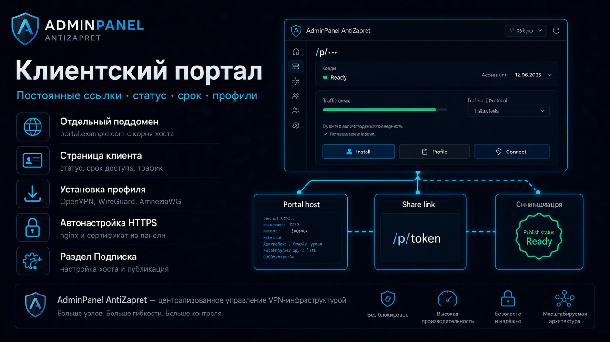

# Подписка

  

  

## Зачем этот раздел

Настройка **клиентского портала** (отдельный хост со ссылками на конфиги), **срока доступа на уровне пользователя** панели и **unlock-ключей** для продления подписки.

## Кто может пользоваться

Только **администратор**. Разделы видны, если включены модули `client_portal` и/или `unlock_codes` (**Настройки → Разделы панели**).

## Как открыть

Боковое меню → **Подписка**. Срок доступа пользователя задаётся в **Настройки → Пользователи** (редактирование учётной записи с ролью «Пользователь»).

---

## Срок доступа пользователя

У каждого пользователя панели (роль **Пользователь**) может быть поле **«Доступ до»** — единая дата окончания подписки. Пустое значение означает **бессрочный** доступ.

### Как это работает

1. Администратор меняет **Доступ до** в карточке пользователя — панель **синхронизирует** этот срок на все VPN-профили (клиенты), которыми владеет пользователь (OpenVPN, WireGuard, AmneziaWG 2.0 на всех узлах), и при HA **реплицирует** политики на реплики. Если reconcile на каком‑то узле не удался, сохранение пользователя всё равно проходит, а в ответе API приходит `access_cascade_warning`.
2. Фоновый worker (модуль **`access_expiry`**, как и раньше для сроков на клиентах) при наступлении `access_until` пользователя **каскадно** блокирует его профили с причиной `access_expired`. Ручные блокировки администратора (бан, временная блокировка и т.п.) **не снимаются** и не перезаписываются этим каскадом.
3. Если срок пользователя **продлевают** (админ или unlock-ключ), панель снова выставляет срок на профили и снимает блокировки `access_expired`, которые были поставлены каскадом (ручные блокировки по-прежнему сохраняются). Unlock-ключ сроки профилей только увеличивает — подробнее в [Как продлевается срок](#как-продлевается-срок).
4. Пользователь с **истёкшим** сроком **не может создавать** новые конфигурации (self-service): API возвращает `subscription_expired`.
5. При **создании** нового профиля (дашборд / CSV) у владельца с заданным `access_until` срок сразу копируется в политику этого профиля.
6. При **обновлении** панели для существующих пользователей с `access_until = NULL` выполняется однократный backfill: в поле пользователя записывается **максимальный** срок среди политик его клиентов (по всем протоколам и узлам). Уже заданное значение не перезаписывается.

### Срок на клиенте vs на пользователе

На дашборде в карточке клиента по-прежнему можно менять **срок доступа профиля**.
Если у владельца **не задан** `access_until`, срок профиля можно выставлять свободно (без `409`).
Если у владельца срок **задан** и новый срок профиля **не совпадает** с ним, панель вернёт **409** с кодом `access_until_conflict` и покажет окно **«Срок клиента расходится со сроком пользователя»**: **«Сохранить поверх»** оставляет клиенту свою дату, **«Отмена»** — ничего не меняет. Кнопка **«Синхронизировать с юзером»** в блоке **«Доступ до»** окна действий клиента приводит срок этого клиента (все протоколы на узле) к сроку владельца.

Выбранная дата означает **конец** этого дня (23:59:59), одинаково на пользователе и на профиле — поэтому совпадающие видимые даты не считаются расхождением. Тот же guard действует на **«Продлить срок»** для WireGuard: расхождение со сроком владельца требует подтверждения.

Сохранение карточки пользователя **не** пересинхронизирует профили, если `access_until` не изменился — подтверждённые переопределения на клиентах сохраняются.

Клиент **без владельца** в панели (legacy / «сирота») живёт по старым правилам: срок только на политиках клиента, unlock и worker работают в привязке к клиенту и узлу.

---

## Клиентский портал

Портал открывается на **отдельном поддомене** с корня хоста (не под путём панели вроде `/panel`). Nginx и сертификат панель настраивает сама под текущий способ публикации (**Настройки → Адрес сайта и HTTPS**). DNS A/AAAA-запись на хост портала нужно создать у регистратора.

### Настроить портал

1. Укажите **Поддомен / хост портала** (без `https://`), например `portal.example.com`
2. Не используйте домен самой панели
3. Нажмите **Сохранить хост**, затем **Настроить под текущую публикацию** и подтвердите (**Настроить**): будет пересобран nginx vhost портала, при необходимости перевыпущен сертификат, доступ к порталу или панели может ненадолго пропасть
4. Дождитесь статуса **Готов**

### Проверить и подготовить (перед настройкой)

Хост вида `portal.panel.example.ru` **разрешён** — панель его не меняет. Подсказка sibling (`portal.example.ru`) только для пустого поля / «Подставить».

На хосте портала открываются только `/p/…`, `/api/public/…` и `/assets/…`. Корень `https://portal.…/` и админ-панель там дают **404** (панель — только на домене панели). Если портал уже был настроен раньше, снова нажмите **Настроить под текущую публикацию**, чтобы обновить nginx-locations под этот allowlist.

Клиентский портал поддерживается **только при публикации через Nginx** (Let's Encrypt / свои / самоподписанные). Режимы uvicorn и прямой HTTP на странице Подписка заблокированы — смените способ в [Адрес сайта и HTTPS](nastrojki/set-i-publikaciya.md) (`/settings/vpn_network`).

Если «Настроить…» падает на Let's Encrypt (404 на `/.well-known/acme-challenge/`): DNS должен указывать на этот сервер; панель перед standalone освобождает порт 80 (nginx останавливается). При занятом :80 смотрите `ss -lptn 'sport = :80'`.

1. **Проверить готовность** — отчёт без изменений
2. **Подготовить** — hash bucket, sync `.env`, безопасная очистка битого portal site; спрашивает подтверждение (возможен reload nginx)
3. Снова **Настроить под текущую публикацию**

Постоянная ссылка **на один VPN-профиль** (клиент на узле): кнопка **Ссылка** на карточке клиента копирует ссылку (при первом нажатии создаёт). **Перевыпустить** и **Отозвать** — в окне действий клиента (**Ещё**), блок **«Клиентский портал»**; обе спрашивают подтверждение, старая ссылка после них перестаёт открываться. **Новые** токены таких ссылок выпускаются с префиксом **`c_`** (client); старые ссылки без префикса продолжают работать. Страница портала показывает конфиги и unlock только для этого клиента.

### Портал пользователя (несколько профилей)

На странице **Подписка** → блок **«Портал пользователей»** администратор выпускает ссылку на **все** клиентские профили выбранного пользователя панели. Токены начинаются с **`u_`** (user). На портале отображаются все owned-конфиги пользователя; общий срок подписки берётся с пользователя. Ссылка **отключённого** пользователя не открывается (`403`).

Unlock-ключ на таком портале **не привязан** к выбранному в списке профилю: панель сама берёт первый подходящий профиль пользователя (пропуская несовместимые по протоколу/списку клиентов ключа и вручную заблокированные администратором) и продлевает **срок пользователя** (если он задан) и сроки его профилей — правила в [Как продлевается срок](#как-продлевается-срок).

Список файлов на портале (скачивание и «Импорт в OpenVPN») учитывает **Видимость VPN-профилей** владельца: маршруты AZ/VPN, протоколы и группы OpenVPN — те же настройки, что в **Настройки → Пользователи** (или глобальный default). Скрытый профиль не показывается и не отдаётся по прямой ссылке download (`404`). У конфига без владельца применяется глобальный default видимости.

У ссылок пользователей кнопки **Создать**, **Скопировать**, **Перевыпустить** и **Отозвать**. **Перевыпустить** и **Отозвать** спрашивают подтверждение: старая ссылка перестанет открываться, после перевыпуска новую нужно отправить пользователю.

После restore из бэкапа nginx/сертификаты портала не восстанавливаются автоматически — снова нажмите **Настроить под текущую публикацию**. Подробнее: [резервные копии](nastrojki/rezervnye-kopii.md).

Публикация панели: [Адрес сайта и HTTPS](nastrojki/set-i-publikaciya.md).

---

## Unlock-ключи

Одноразовые или многоразовые коды, которыми клиент **продлевает доступ** на N дней (по протоколам, выбранным в ключе).

### Как продлевается срок

Результат зависит от того, по какой ссылке открыт портал.

**Портал клиента (`c_…`)** — продлевается **только этот клиент**, даже если у него есть владелец: срок владельца и других его профилей не меняется.

- Новый срок = текущий срок клиента (или «сейчас», если он уже прошёл) + дни ключа — по тем протоколам ключа, которые есть у клиента.
- Ключ, выпущенный для конкретных клиентов (поле **«Клиенты»**), продлевает все протоколы клиента на узле до одной общей даты — от самого раннего текущего срока.
- У **бессрочного** клиента после активации появится срок «сейчас + дни ключа».
- Тот же код этим клиентом на этом узле повторно не активировать; другой клиент (в том числе того же владельца) может, пока не исчерпан лимит активаций.

**Портал пользователя (`u_…`)** — сроки профилей только растут: бессрочные остаются бессрочными, более долгие не сокращаются.

- У пользователя задан **«Доступ до»** — он продлевается: его текущий срок (или «сейчас», если прошёл) + дни ключа. Все профили пользователя со сроком (по всем протоколам) поднимаются как минимум до новой даты; истёкший профиль разблокируется, изменения реплицируются в HA.
- **«Доступ до» не задан** — продлеваются только профили со сроком и только по протоколам ключа, каждый от своего срока (или от «сейчас»). Если все такие профили бессрочные, ключ не принимается: «Срок ваших профилей не ограничен — продлевать нечего».
- Ключ, выпущенный для конкретных клиентов, продлевает только профили пользователя из списка ключа (каждый от своего срока) и **не меняет** «Доступ до» пользователя.
- Один пользователь активирует один и тот же код только один раз.

**Когда ключ считается использованным.** Активация засчитывается (счётчик **активаций N / M** и строка в **Активации**) только при успешном продлении. Если ключ отклонён — неверный, отозван, истёк **Срок жизни кода**, исчерпан лимит, уже использован, не предназначен для этого клиента, нет общих протоколов, профиль вручную заблокирован или продлевать нечего, — активация не расходуется.

Ключ не снимает **ручную** блокировку администратора. В портале клиента вручную заблокированный клиент получает отказ «Данный пользователь заблокирован администратором вручную…». В портале пользователя такой профиль пропускается, а ключ применяется через другой профиль пользователя (блокировка остаётся).

### Создать ключ

1. На странице **Подписка** в блоке **Unlock-ключи** нажмите **Создать ключ** (или в окне действий клиента → **Создать unlock-ключ** — клиент подставится в список)
2. Заполните **Срок продления, дни**, **Срок жизни кода**, **Режим** (**Single** — одна активация, **Multi** — до **Макс. активаций**), при необходимости **Клиенты (опционально)**; без списка клиентов выберите **Протоколы**
3. Нажмите **Создать**, скопируйте код и передайте клиенту безопасным каналом

Активация — только на **клиентском портале** (`c_…` или `u_…`): поле unlock-кода и кнопка **Активировать ключ**.

### Отозвать ключ

В списке ключей нажмите **Отозвать** и подтвердите — код перестанет приниматься сразу. Вернуть ключ нельзя; доступ, уже продлённый по нему, сохраняется.

---

## Telegram: напоминания о сроке

Если у пользователя (в том числе **администратора**) задан `access_until` и до истечения осталось не больше порога из настроек self-service, панель может отправить:

- **владельцу** в Telegram — событие `access_expiry_reminder` («Доступ скоро истечёт»), если включены личные уведомления и привязан Telegram;
- **администраторам** — событие `user_access_expiry_reminder` в AdminNotify/Telegram.

Напоминания о **сертификате OpenVPN** (`cert_expiry_reminder` / `user_cert_expiry_reminder`) по-прежнему считаются **по каждому клиенту**, а не по полю пользователя.

---

## Частые вопросы

**Чем это отличается от «Раздачи конфигов»?**  
**Выдача VPN-профилей** — QR и публичные route-файлы из настроек. **Подписка** — срок на пользователе, портал на отдельном хосте и unlock-коды продления.

**Зачем два типа ссылок портала (`c_` и `u_`)?**  
`c_` — один клиент на узле (как раньше). `u_` — один URL на все профили пользователя, удобно при нескольких конфигурациях.

**Модуль выключен — страница пустая?**  
Включите `client_portal` и/или `unlock_codes` в **Настройки → Разделы панели**.

---

[← Все руководства](README.md)
